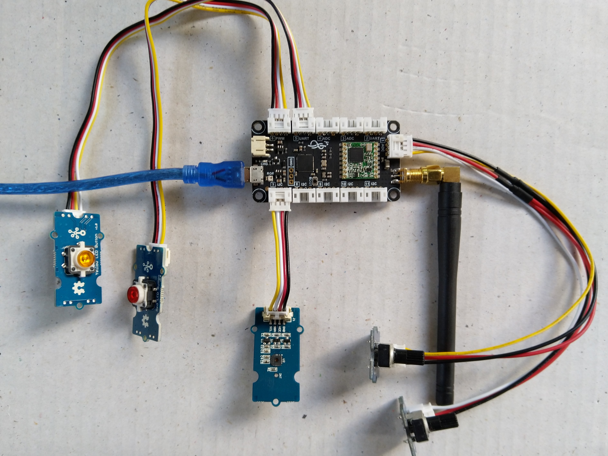

# IngenuityMicroNexusPortTestHarness
Test harness for exercising all of the Analog, GPIO, I2C, PWM, &amp; UART ports on an Ingenuity Micro Nexus

The test rig uses a selection of Seeedstudio Grove sensors

I had to modify a couple of Grove cables by gently lifting the crimp latches so I could pop the cables out

